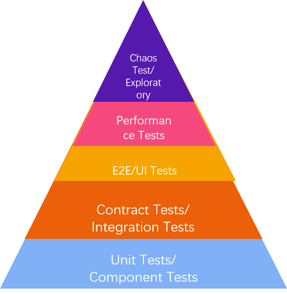

# Overview

dfafsdf
 <table style="width:100%" id="tableInRichEditor_1660540387411"><tbody><tr><td class="border-normal" style="height: 42px; width: 49%;" id="0-0" colspan="1" rowspan="1">         fdasdfdsf                    </td><td class="border-normal" style="height:42px;width:49%" rowspan="1" colspan="1" id="0-1"> </td></tr><tr><td class="border-normal" style="height:42px;width:49%" colspan="1" id="1-0"> </td><td class="border-normal" style="height:42px;width:49%" rowspan="1" colspan="1" id="1-1"> </td></tr><tr><td class="border-normal" style="height:42px;width:49%" colspan="1" id="2-0"> </td><td class="border-normal" style="height:42px;width:49%" rowspan="1" colspan="1" id="2-1"> </td></tr><tr><td class="border-normal" style="height:42px;width:49%" colspan="1" id="3-0"> </td><td class="border-normal" style="height:42px;width:49%" rowspan="1" colspan="1" id="3-1"> </td></tr></tbody></table> 

