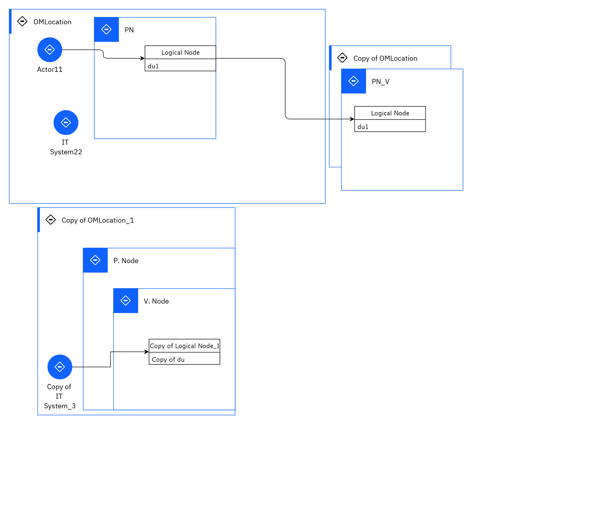

## Diagram

### Name

pom1

### Description

## Element

[Expand all](#){ .md-button .diff-line }

### Actor

    

Actor11

<table>
    <caption></caption>
    <thead>
        <tr>
            <th></th>
            <th></th>
        </tr>
    </thead>
    <tr>
        <td> <strong>Name</strong> </td>
        <td>Actor11</td>
    </tr>
    <tr>
        <td> <strong>Description</strong> </td>
        <td></td>
    </tr>
    <tr>
        <td> <strong>Type</strong> </td>
        <td>Human</td>
    </tr>
    <tr>
        <td> <strong>Generic Group</strong> </td>
<td>
        
</td>
    </tr>
</table>

    

Copy of IT System_3

<table>
    <caption></caption>
    <thead>
        <tr>
            <th></th>
            <th></th>
        </tr>
    </thead>
    <tr>
        <td> <strong>Name</strong> </td>
        <td>Copy of IT System_3</td>
    </tr>
    <tr>
        <td> <strong>Description</strong> </td>
        <td></td>
    </tr>
    <tr>
        <td> <strong>Type</strong> </td>
        <td>IT System</td>
    </tr>
    <tr>
        <td> <strong>Generic Group</strong> </td>
<td>
        
</td>
    </tr>
</table>

    

IT System22

<table>
    <caption></caption>
    <thead>
        <tr>
            <th></th>
            <th></th>
        </tr>
    </thead>
    <tr>
        <td> <strong>Name</strong> </td>
        <td>IT System22</td>
    </tr>
    <tr>
        <td> <strong>Description</strong> </td>
        <td></td>
    </tr>
    <tr>
        <td> <strong>Type</strong> </td>
        <td>IT System</td>
    </tr>
    <tr>
        <td> <strong>Generic Group</strong> </td>
<td>
        
</td>
    </tr>
</table>

    

### Subsystem

### OMLocation

    

Copy of OMLocation

<table>
    <caption></caption>
    <thead>
        <tr>
            <th></th>
            <th></th>
        </tr>
    </thead>
    <tr>
        <td> <strong>Name</strong> </td>
        <td>Copy of OMLocation</td>
    </tr>
    <tr>
        <td> <strong>Description</strong> </td>
        <td></td>
    </tr>
</table>

    

Copy of OMLocation_1

<table>
    <caption></caption>
    <thead>
        <tr>
            <th></th>
            <th></th>
        </tr>
    </thead>
    <tr>
        <td> <strong>Name</strong> </td>
        <td>Copy of OMLocation_1</td>
    </tr>
    <tr>
        <td> <strong>Description</strong> </td>
        <td></td>
    </tr>
</table>

    

OMLocation

<table>
    <caption></caption>
    <thead>
        <tr>
            <th></th>
            <th></th>
        </tr>
    </thead>
    <tr>
        <td> <strong>Name</strong> </td>
        <td>OMLocation</td>
    </tr>
    <tr>
        <td> <strong>Description</strong> </td>
        <td></td>
    </tr>
</table>

    

### Logical Connection

    

<table>
    <caption></caption>
    <thead>
        <tr>
            <th></th>
            <th></th>
        </tr>
    </thead>
    <tr>
        <td> <strong>Name</strong> </td>
        <td></td>
    </tr>
    <tr>
        <td> <strong>Description</strong> </td>
        <td></td>
    </tr>
</table>

    

<table>
    <caption></caption>
    <thead>
        <tr>
            <th></th>
            <th></th>
        </tr>
    </thead>
    <tr>
        <td> <strong>Name</strong> </td>
        <td></td>
    </tr>
    <tr>
        <td> <strong>Description</strong> </td>
        <td></td>
    </tr>
</table>

    

<table>
    <caption></caption>
    <thead>
        <tr>
            <th></th>
            <th></th>
        </tr>
    </thead>
    <tr>
        <td> <strong>Name</strong> </td>
        <td></td>
    </tr>
    <tr>
        <td> <strong>Description</strong> </td>
        <td></td>
    </tr>
</table>

    

### Logical Node

    

Copy of Logical Node_1

<table>
    <caption></caption>
    <thead>
        <tr>
            <th></th>
            <th></th>
        </tr>
    </thead>
    <tr>
        <td> <strong>Name</strong> </td>
        <td>Copy of Logical Node_1</td>
    </tr>
    <tr>
        <td> <strong>Description</strong> </td>
        <td>desc updated in excel change</td>
    </tr>
    <tr>
        <td> <strong>Type</strong> </td>
        <td></td>
    </tr>
    <tr>
        <td> <strong>Primary Capability</strong> </td>
        <td>
            
                
ai services

            
        </td>
    </tr>
    <tr>
        <td> <strong>Implementation</strong> </td>
        <td>
            
                
<a href="">Copy of pc1_1</a>

            
        </td>
    </tr>
    <tr>
        <td> <strong>Architectural Decision</strong> </td>
        <td>
            
        </td>
    </tr>
    <tr>
        <td> <strong>Non Functional Requirement</strong> </td>
        <td>
            
        </td>
    </tr>
    <tr>
        <td> <strong>Generic Group</strong> </td>
        <td></td>
    </tr>
    <tr>
        <td> <strong>Sub-level Diagram</strong> </td>
        <td></td>
    </tr>
    <tr>
        <td> <strong>Related Diagrams</strong> </td>
        <td></td>
    </tr>
    <tr>
        <td> <strong>Related Elements</strong> </td>
        <td>
            
                
V. Node

                
                    
                    <li><a href="../../Prescribed Operational View/pomview_3cKhRL8W8aK_3cKij3jwm19_ry1r9mr7s">pom2</a></li>
                    
                    <li><a href="../../Prescribed Operational View/pomview_3cKhRL8W8aK_ry1r9mr7s">pom1</a></li>
                    
                
            
            
                
ai services

                
            
                
Copy of du

                
            
        </td>
    </tr>
</table>

    

Logical Node

<table>
    <caption></caption>
    <thead>
        <tr>
            <th></th>
            <th></th>
        </tr>
    </thead>
    <tr>
        <td> <strong>Name</strong> </td>
        <td>Logical Node</td>
    </tr>
    <tr>
        <td> <strong>Description</strong> </td>
        <td></td>
    </tr>
    <tr>
        <td> <strong>Type</strong> </td>
        <td></td>
    </tr>
    <tr>
        <td> <strong>Primary Capability</strong> </td>
        <td>
            
        </td>
    </tr>
    <tr>
        <td> <strong>Implementation</strong> </td>
        <td>
            
                
<a href="">pc1</a>

            
                
<a href="">pc2</a>

            
        </td>
    </tr>
    <tr>
        <td> <strong>Architectural Decision</strong> </td>
        <td>
            
                
<a href="../../Architectural Decisions/architecturaldecision_BktwQEhNOmK_3cK7GYq87X4_ry1r9mr7s">AD Name1</a>

            
        </td>
    </tr>
    <tr>
        <td> <strong>Non Functional Requirement</strong> </td>
        <td>
            
        </td>
    </tr>
    <tr>
        <td> <strong>Generic Group</strong> </td>
        <td></td>
    </tr>
    <tr>
        <td> <strong>Sub-level Diagram</strong> </td>
        <td></td>
    </tr>
    <tr>
        <td> <strong>Related Diagrams</strong> </td>
        <td>
            
                
<a href="../../Logical Operational View/lomview_3cKh0Nydeat_ry1r9mr7s">lom1</a>

            
                
<a href="../../Prescribed Operational View/pomview_3cKhRL8W8aK_3cKij3jwm19_ry1r9mr7s">pom2</a>

            
                
<a href="../../Prescribed Operational View/pomview_3cKhRL8W8aK_ry1r9mr7s">pom1</a>

            
        </td>
    </tr>
    <tr>
        <td> <strong>Related Elements</strong> </td>
        <td>
            
                
PN_V

                
                    
                    <li><a href="../../Prescribed Operational View/pomview_3cKhRL8W8aK_3cKij3jwm19_ry1r9mr7s">pom2</a></li>
                    
                    <li><a href="../../Prescribed Operational View/pomview_3cKhRL8W8aK_ry1r9mr7s">pom1</a></li>
                    
                
            
                
PN

                
                    
                    <li><a href="../../Prescribed Operational View/pomview_3cKhRL8W8aK_3cKij3jwm19_ry1r9mr7s">pom2</a></li>
                    
                    <li><a href="../../Prescribed Operational View/pomview_3cKhRL8W8aK_ry1r9mr7s">pom1</a></li>
                    
                
            
                
AD Name1

                
            
                
OMLocation

                
                    
                    <li><a href="../../Prescribed Operational View/pomview_3cKhRL8W8aK_3cKij3jwm19_ry1r9mr7s">pom2</a></li>
                    
                    <li><a href="../../Prescribed Operational View/pomview_3cKhRL8W8aK_ry1r9mr7s">pom1</a></li>
                    
                    <li><a href="../../Logical Operational View/lomview_3cKh0Nydeat_ry1r9mr7s">lom1</a></li>
                    
                
            
            
                
du1

                
                    
                    <li>
<a href="../../Prescribed Operational View/pomview_3cKhRL8W8aK_3cKij3jwm19_ry1r9mr7s">pom2</a>
</li>
                    
                    <li>
<a href="../../Prescribed Operational View/pomview_3cKhRL8W8aK_ry1r9mr7s">pom1</a>
</li>
                    
                    <li>
<a href="../../Logical Operational View/lomview_3cKh0Nydeat_ry1r9mr7s">lom1</a>
</li>
                    
                    <li>
<a href="../../Collaboration View/cmcollaboration_3cKfN2pctKf_ry1r9mr7s">cv</a>
</li>
                    
                    <li>
<a href="../../Sequence View/cmdynamicview_3cKebmrlVhY_ry1r9mr7s">seq</a>
</li>
                    
                    <li>
<a href="../../Static View/cmstaticview_3cK8w4gMqN8_ry1r9mr7s">sv2</a>
</li>
                    
                    <li>
<a href="../../Static View/cmstaticview_3cK6VgIEQoD_ry1r9mr7s">sv</a>
</li>
                    
                
            
        </td>
    </tr>
</table>

    

### Physical Connection

    

### Physical Node

    

P. Node

<table>
    <caption></caption>
    <thead>
        <tr>
            <th></th>
            <th></th>
        </tr>
    </thead>
    <tr>
        <td> <strong>Name</strong> </td>
        <td>P. Node</td>
    </tr>
    <tr>
        <td> <strong>Description</strong> </td>
        <td></td>
    </tr>
    <tr>
        <td> <strong>Cardinality</strong> </td>
        <td>1</td>
    </tr>
    <tr>
        <td> <strong>CPU/Cores</strong> </td>
        <td></td>
    </tr>
    <tr>
        <td> <strong>Memory</strong> </td>
        <td></td>
    </tr>
    <tr>
        <td> <strong>Network ports</strong> </td>
        <td></td>
    </tr>
    <tr>
        <td> <strong>OS/Hyper-visor</strong> </td>
        <td></td>
    </tr>
    <tr>
        <td> <strong>Deploy</strong> </td>
        <td></td>
    </tr>
    <tr>
        <td> <strong>Deploy Provisioning</strong> </td>
        <td></td>
    </tr>
</table>

    

PN

<table>
    <caption></caption>
    <thead>
        <tr>
            <th></th>
            <th></th>
        </tr>
    </thead>
    <tr>
        <td> <strong>Name</strong> </td>
        <td>PN</td>
    </tr>
    <tr>
        <td> <strong>Description</strong> </td>
        <td></td>
    </tr>
    <tr>
        <td> <strong>Cardinality</strong> </td>
        <td>1</td>
    </tr>
    <tr>
        <td> <strong>CPU/Cores</strong> </td>
        <td></td>
    </tr>
    <tr>
        <td> <strong>Memory</strong> </td>
        <td></td>
    </tr>
    <tr>
        <td> <strong>Network ports</strong> </td>
        <td></td>
    </tr>
    <tr>
        <td> <strong>OS/Hyper-visor</strong> </td>
        <td></td>
    </tr>
    <tr>
        <td> <strong>Deploy</strong> </td>
        <td></td>
    </tr>
    <tr>
        <td> <strong>Deploy Provisioning</strong> </td>
        <td></td>
    </tr>
</table>

    

PN_V

<table>
    <caption></caption>
    <thead>
        <tr>
            <th></th>
            <th></th>
        </tr>
    </thead>
    <tr>
        <td> <strong>Name</strong> </td>
        <td>PN_V</td>
    </tr>
    <tr>
        <td> <strong>Description</strong> </td>
        <td></td>
    </tr>
    <tr>
        <td> <strong>Cardinality</strong> </td>
        <td>1</td>
    </tr>
    <tr>
        <td> <strong>CPU/Cores</strong> </td>
        <td></td>
    </tr>
    <tr>
        <td> <strong>Memory</strong> </td>
        <td></td>
    </tr>
    <tr>
        <td> <strong>Network ports</strong> </td>
        <td></td>
    </tr>
    <tr>
        <td> <strong>OS/Hyper-visor</strong> </td>
        <td></td>
    </tr>
    <tr>
        <td> <strong>Deploy</strong> </td>
        <td></td>
    </tr>
    <tr>
        <td> <strong>Deploy Provisioning</strong> </td>
        <td></td>
    </tr>
</table>

    

V. Node

<table>
    <caption></caption>
    <thead>
        <tr>
            <th></th>
            <th></th>
        </tr>
    </thead>
    <tr>
        <td> <strong>Name</strong> </td>
        <td>V. Node</td>
    </tr>
    <tr>
        <td> <strong>Description</strong> </td>
        <td></td>
    </tr>
    <tr>
        <td> <strong>Cardinality</strong> </td>
        <td>1</td>
    </tr>
    <tr>
        <td> <strong>CPU/Cores</strong> </td>
        <td></td>
    </tr>
    <tr>
        <td> <strong>Memory</strong> </td>
        <td></td>
    </tr>
    <tr>
        <td> <strong>Network ports</strong> </td>
        <td></td>
    </tr>
    <tr>
        <td> <strong>OS/Hyper-visor</strong> </td>
        <td></td>
    </tr>
    <tr>
        <td> <strong>Deploy</strong> </td>
        <td></td>
    </tr>
    <tr>
        <td> <strong>Deploy Provisioning</strong> </td>
        <td></td>
    </tr>
</table>

    

