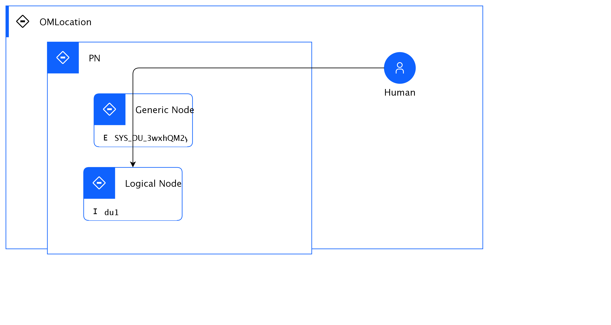

## Diagram

### Name

pom

### Description

## Element

[Expand all](#){ .md-button .diff-line }

### Actor

    

Human

<table>
    <caption></caption>
    <thead>
        <tr>
            <th></th>
            <th></th>
        </tr>
    </thead>
    <tr>
        <td> <strong>Name</strong> </td>
        <td>Human</td>
    </tr>
    <tr>
        <td> <strong>Description</strong> </td>
        <td></td>
    </tr>
    <tr>
        <td> <strong>Type</strong> </td>
        <td>Human</td>
    </tr>
    <tr>
        <td> <strong>Generic Group</strong> </td>
<td>
        
                
                
<strong>Zone,Zone</strong>[Auto-Generated]

                
This group is derived from Zone named Zone.

                
                
</td>
    </tr>
</table>

    

### Subsystem

### OMLocation

    

OMLocation

<table>
    <caption></caption>
    <thead>
        <tr>
            <th></th>
            <th></th>
        </tr>
    </thead>
    <tr>
        <td> <strong>Name</strong> </td>
        <td>OMLocation</td>
    </tr>
    <tr>
        <td> <strong>Description</strong> </td>
        <td></td>
    </tr>
</table>

    

### Logical Connection

    

<table>
    <caption></caption>
    <thead>
        <tr>
            <th></th>
            <th></th>
        </tr>
    </thead>
    <tr>
        <td> <strong>Name</strong> </td>
        <td></td>
    </tr>
    <tr>
        <td> <strong>Description</strong> </td>
        <td></td>
    </tr>
</table>

    

### Logical Node

    

Generic Node

<table>
    <caption></caption>
    <thead>
        <tr>
            <th></th>
            <th></th>
        </tr>
    </thead>
    <tr>
        <td> <strong>Name</strong> </td>
        <td>Generic Node</td>
    </tr>
    <tr>
        <td> <strong>Description</strong> </td>
        <td></td>
    </tr>
    <tr>
        <td> <strong>Type</strong> </td>
        <td></td>
    </tr>
    <tr>
        <td> <strong>Primary Capability</strong> </td>
        <td>
            
        </td>
    </tr>
    <tr>
        <td> <strong>Implementation</strong> </td>
        <td>
            
                
<a href="">pc</a>

            
        </td>
    </tr>
    <tr>
        <td> <strong>Architectural Decision</strong> </td>
        <td>
            
        </td>
    </tr>
    <tr>
        <td> <strong>Non Functional Requirement</strong> </td>
        <td>
            
        </td>
    </tr>
    <tr>
        <td> <strong>Generic Group</strong> </td>
        <td>
                
                
<strong>Zone,Zone</strong>[Auto-Generated]

                
This group is derived from Zone named Zone.

                
                
<strong>SubSystem,SubSystem</strong>[Auto-Generated]

                
This group is derived from SubSystem named SubSystem.

                
            </td>
    </tr>
    <tr>
        <td> <strong>Sub-level Diagram</strong> </td>
        <td></td>
    </tr>
    <tr>
        <td> <strong>Related Diagrams</strong> </td>
        <td>
            
                
<a href="../../Usage Scenario/aodusagescenario_3wxpM8kNsqb">istsv</a>

            
                
<a href="../../IT System View/aoditsystem_S1xS-MCLPCq">itsv</a>

            
                
<a href="../../IT System View/aoditsystem_SyCHWfRIPRq">itsv2</a>

            
                
<a href="../../Prescribed Operational View/pomview_ryAPWz08PRc">pom</a>

            
        </td>
    </tr>
    <tr>
        <td> <strong>Related Elements</strong> </td>
        <td>
            
                
PN

                
                    
                    <li><a href="../../Prescribed Operational View/pomview_ryAPWz08PRc">pom</a></li>
                    
                
            
            
                
SYS_DU_3wxhQM2yeNE

                
            
        </td>
    </tr>
</table>

    

Logical Node

<table>
    <caption></caption>
    <thead>
        <tr>
            <th></th>
            <th></th>
        </tr>
    </thead>
    <tr>
        <td> <strong>Name</strong> </td>
        <td>Logical Node</td>
    </tr>
    <tr>
        <td> <strong>Description</strong> </td>
        <td></td>
    </tr>
    <tr>
        <td> <strong>Type</strong> </td>
        <td></td>
    </tr>
    <tr>
        <td> <strong>Primary Capability</strong> </td>
        <td>
            
        </td>
    </tr>
    <tr>
        <td> <strong>Implementation</strong> </td>
        <td>
            
        </td>
    </tr>
    <tr>
        <td> <strong>Architectural Decision</strong> </td>
        <td>
            
        </td>
    </tr>
    <tr>
        <td> <strong>Non Functional Requirement</strong> </td>
        <td>
            
        </td>
    </tr>
    <tr>
        <td> <strong>Generic Group</strong> </td>
        <td></td>
    </tr>
    <tr>
        <td> <strong>Sub-level Diagram</strong> </td>
        <td></td>
    </tr>
    <tr>
        <td> <strong>Related Diagrams</strong> </td>
        <td>
            
                
<a href="../../Logical Operational View/lomview_r1VDbzRLvAc">lom1</a>

            
                
<a href="../../Prescribed Operational View/pomview_ryAPWz08PRc">pom</a>

            
        </td>
    </tr>
    <tr>
        <td> <strong>Related Elements</strong> </td>
        <td>
            
                
PN

                
                    
                    <li><a href="../../Prescribed Operational View/pomview_ryAPWz08PRc">pom</a></li>
                    
                
            
                
OMLocation

                
                    
                    <li><a href="../../Prescribed Operational View/pomview_ryAPWz08PRc">pom</a></li>
                    
                    <li><a href="../../Logical Operational View/lomview_r1VDbzRLvAc">lom1</a></li>
                    
                
            
            
                
du1

                
            
        </td>
    </tr>
</table>

    

### Physical Connection

    

### Physical Node

    

PN

<table>
    <caption></caption>
    <thead>
        <tr>
            <th></th>
            <th></th>
        </tr>
    </thead>
    <tr>
        <td> <strong>Name</strong> </td>
        <td>PN</td>
    </tr>
    <tr>
        <td> <strong>Description</strong> </td>
        <td></td>
    </tr>
    <tr>
        <td> <strong>Cardinality</strong> </td>
        <td>1</td>
    </tr>
    <tr>
        <td> <strong>CPU/Cores</strong> </td>
        <td>4</td>
    </tr>
    <tr>
        <td> <strong>Memory</strong> </td>
        <td>4</td>
    </tr>
    <tr>
        <td> <strong>Network ports</strong> </td>
        <td>4</td>
    </tr>
    <tr>
        <td> <strong>OS/Hyper-visor</strong> </td>
        <td>4</td>
    </tr>
    <tr>
        <td> <strong>Deploy</strong> </td>
        <td>Managed</td>
    </tr>
    <tr>
        <td> <strong>Deploy Provisioning</strong> </td>
        <td></td>
    </tr>
</table>

    

